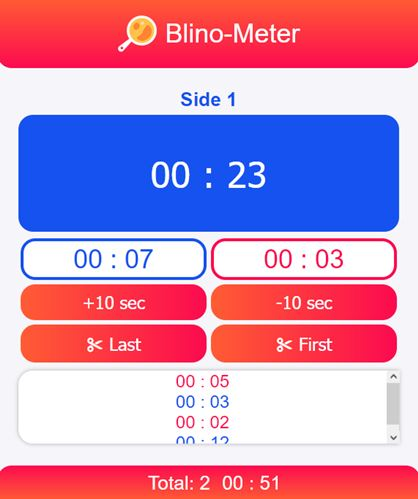

#  Blino-Meter

Проект Blino-Meter помогает жарить блины 😆 Этот кухонный секундомер считает отдельно время для двух сторон, ведет локальную историю приготовления, подсчитывает количество блинов, общее и среднее время жарки. А главное, предупреждает звуком, когда блин жарится дольше предыдущих значений, что исключает потребность постоянно следить за временем.

Когда я жарю блины, то часто отвлекаюсь и не слежу за временем. Что бы постоянно не дергать сковороду и блин на ней, я решил сделать для себя этот простой проект-секундомер. И теперь я всегда точно знаю сколько времени блин провел на сковороде и, основываясь на предыдущих значениях, не пора ли уже его снимать.

## Особенности

Использованные технологии: **JavaScript, HTML, CSS, Webpack**.

Логика проекта основана на манипулировании **DOM**, все данные хранятся и обрабатываются в элементах HTML: добавление, удаление, изменение содержимого.

## Интерфейс

Главная кнопка запускает секундомер для первой стороны, следующее нажатие ставит паузу. Затем запускается для второй стороны и снова пауза. И так по циклу. Под кнопками расположена область, в которую попадают предыдущие значения с разделением сторон по цвету.

Сразу под кнопкой отображается среднее время приготовления отдельно для каждой стороны.

### Дополнительные кнопки корректировки

- `+10 sec` - Прибавить 10 секунд к новому значению в списке
- `+10 sec` - Отнять 10 секунд от нового значения
- `Last` - Удалить последнее (свежее) значение
- `First` - Удалить первое (самое старое) значение

В самом низу расположено общее время приготовления, считаемое от первого нажатия, и количество приготовленных блинов.
